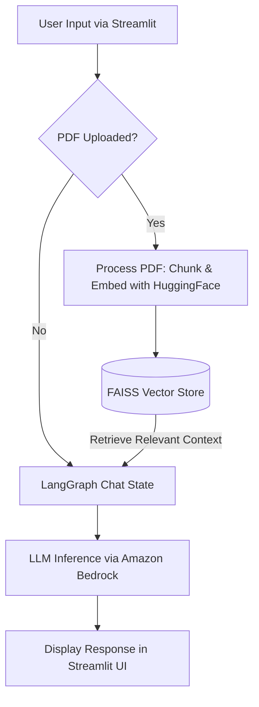

# 🤖 Agentic RAG Chatbot

An intelligent, stateful AI assistant built with **LangGraph**, **LangChain**, and **Streamlit**. This application features a sleek web interface and supports Retrieval-Augmented Generation (RAG) by allowing users to upload PDF documents and seamlessly interact with their contents.

## ✨ Features

- **Stateful Conversation**: Powered by LangGraph's state machine (`StateGraph`) and `InMemorySaver` to maintain chat history and thread persistence.
- **Retrieval-Augmented Generation (RAG)**: Upload any PDF document on the fly. The system chunks, embeds, and indexes the document using **FAISS** and **HuggingFace Embeddings** to provide highly relevant context for answers.
- **Cloud AI Inference**: Powered by **Amazon Bedrock** (using Qwen) for significantly faster inference and high-performance responses, replacing the previous Ollama setup.
- **Modern User Interface**: A responsive, clean, and interactive chat UI built with Streamlit, custom CSS, and a document upload sidebar.

## 🛠️ Technology Stack

- **Framework**: [LangChain](https://python.langchain.com/) & [LangGraph](https://python.langchain.com/docs/langgraph)
- **UI**: [Streamlit](https://streamlit.io/)
- **Vector Database**: FAISS (Facebook AI Similarity Search)
- **Embeddings**: HuggingFace (`all-MiniLM-L6-v2`)
- **LLM Engine**: [Amazon Bedrock](https://aws.amazon.com/bedrock/) (Fast, managed cloud AI model access)

## 🏗️ Architecture



## 🚀 Getting Started

### Prerequisites

Ensure you have Python 3.12+ and an environment manager like `uv` or `pip` installed.

### Installation

1. **Navigate to the directory**:

   ```bash
   cd basic_chatbot
   ```
2. **Install the dependencies**:
   (Ensure you are in your active virtual environment)

   ```bash
   pip install streamlit langchain langchain-aws langgraph langgraph-checkpoint faiss-cpu langchain-huggingface pypdf boto3
   ```
3. **Configure Environment Variables**:
   Create a `.env` file in the root directory if you need to configure specific API keys for the model endpoints.

   ```env
   # Example configurations
   AWS_ACCESS_KEY_ID=your_access_key
   AWS_SECRET_ACCESS_KEY=your_secret_key
   AWS_DEFAULT_REGION=your_aws_region
   HF_TOKEN=your_huggingface_token
   ```

### Running the Application

Start the Streamlit server:

```bash
streamlit run frontend.py
```

The application will launch in your browser at `http://localhost:8501`.

## 💡 Usage

1. **General Chat**: Simply type your message in the chat input at the bottom of the screen. The chatbot maintains context across the conversation thread.
2. **Document Q&A**:
   - Open the sidebar on the left.
   - Upload a `.pdf` file.
   - Click **"Process PDF"**.
   - Once the success message appears, the chatbot is now contextually aware of the document's contents. Ask questions directly related to it!
3. **Reset Chat**: Click the 🗑️ icon in the top right corner to instantly clear the current conversation thread.

---

*Developed as a demonstration of modern AI engineering, combining agentic workflows with robust document retrieval.*

# langgraph-rag-chatbot

